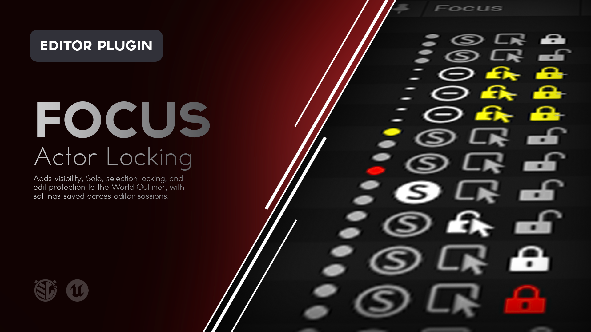
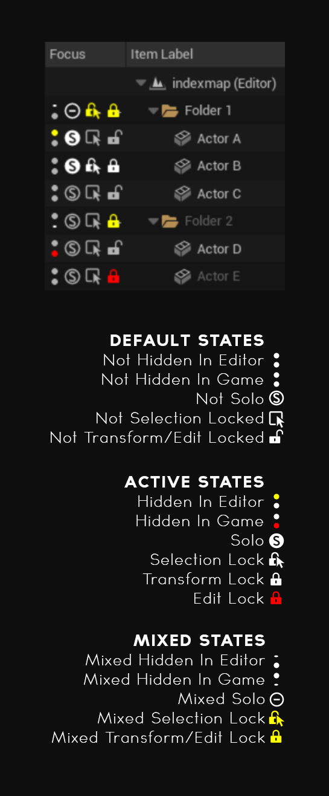
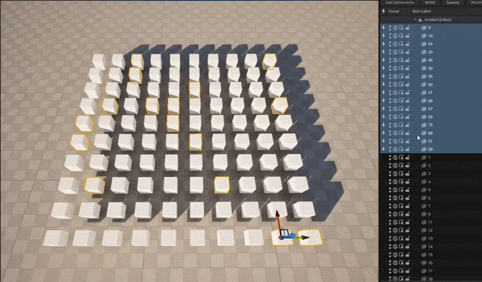
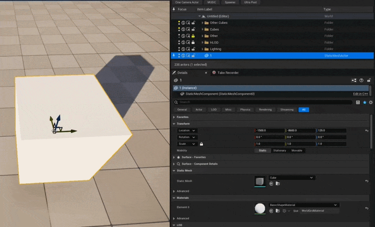

# Focus

**Visibility, isolation, and editing protection directly in Unreal Engine's World Outliner.**

Focus expands the standard World Outliner with tools for hiding, isolating, selecting, and protecting Actors while you work.

Control individual Actors, entire folders, attached hierarchies, groups, or multi-selections without leaving the Outliner.




---

## What is Focus?

As levels grow more complicated, simply selecting and organizing Actors becomes more difficult.

Large background meshes get clicked accidentally. Finished geometry gets nudged. Important Actors get edited unintentionally. Working on one part of a dense scene can require repeatedly hiding and unhiding everything around it.

Focus adds a set of scene-management controls directly to the World Outliner so those problems can be handled where the level hierarchy already lives.

With Focus you can:

- Hide Actors in the editor
    
- Control Hidden in Game
    
- Solo parts of a level
    
- Prevent viewport selection
    
- Lock Actor transforms
    
- Protect Actors and Components from editing
    
- Apply those controls to entire hierarchies at once
    

Focus is designed to make large scenes easier to work in without changing the way Unreal's World Outliner normally functions.

---

# Features

### World Outliner Controls

Focus adds its controls directly to the standard World Outliner.

No additional editor window is required.

### Hide in Editor

Temporarily hide Actors from editor viewports without affecting their Hidden in Game state.

### Hidden in Game

Control Unreal's existing Hidden in Game property directly from the World Outliner.

### Solo

Temporarily isolate Actors, folders, or hierarchies while working in the editor.

### Selection Lock

Prevent Actors from being selected accidentally through the viewport while keeping them selectable through the World Outliner.

### Transform Lock

Protect Actor location, rotation, and scale while leaving other properties editable.

### Edit Lock

Protect supported Actor and Component editing while keeping their properties available for inspection.

### Hierarchy Support

Apply Focus controls to:

- Individual Actors
    
- Attached Actor hierarchies
    
- Folders
    
- Nested folders
    
- Groups
    
- Nested groups
    

### Multi-Selection Support

Apply Focus controls across several selected Actors or folders at once.

### Mixed States

Focus indicates when a hierarchy contains a mixture of enabled and disabled states.

### Undo / Redo

Focus control changes participate in Unreal Engine's normal Undo and Redo workflow.

### Persistent Settings

Focus states can be saved with the affected Actor or level packages and restored later.

### Editor Only

Focus is an editor utility and does not add runtime systems to packaged builds.

---



---

# Using Focus

Focus controls appear directly inside the World Outliner.

Each Actor or supported hierarchy row can display controls for:

|Control|Purpose|
|---|---|
|**Hide in Editor**|Hides the affected Actors from editor viewports.|
|**Hidden in Game**|Controls Unreal's Hidden in Game property.|
|**Solo**|Isolates the affected Actors in editor viewports.|
|**Selection Lock**|Prevents viewport selection.|
|**Protection Lock**|Cycles between Unlocked, Transform Lock, and Edit Lock.|

Most controls can also operate across folders, hierarchies, groups, and multi-selections.

---

## Hide in Editor

The upper visibility control determines whether an Actor is hidden in editor viewports.

When enabled:

- The Actor is hidden while editing.
    
- Hidden in Game is not changed.
    
- The Actor can still remain part of the level.
    

Use this when something needs to be temporarily removed from view while working.

---

## Hidden in Game

The lower visibility control modifies Unreal's existing **Hidden in Game** property.

When enabled, the Actor is hidden during gameplay according to Unreal's normal runtime behavior.

This is separate from Hide in Editor.

That separation allows an Actor to be:

- Visible in the editor but hidden in game
    
- Hidden in the editor but visible in game
    
- Visible in both
    
- Hidden in both
    

---

## Solo

Solo isolates part of the level inside the editor viewport.

You can Solo:

- An Actor
    
- An Actor hierarchy
    
- A Folder
    
- Multiple Actors
    
- Multiple Folders
    
- Groups
    

Multiple Solo targets can be active simultaneously.

When Solo is cleared, normal editor visibility returns.

Solo does not change Hidden in Game.



### Solo and Existing Visibility

Actors already hidden using **Hide in Editor** remain hidden while Solo is active.

Solo should be treated as a temporary viewport isolation tool rather than a replacement for normal level visibility.

Lights, volumes, and other scene systems may continue influencing the viewport even when their Actor is outside the current Solo set.

---

## Selection Lock

Selection Lock prevents an Actor from being selected through the viewport.

When enabled:

- Clicking the Actor in the viewport will not select it.
    
- The Actor can still be selected from the World Outliner.
    
- Its properties can still be inspected.
    
- Selection Lock does not prevent editing by itself.
    

This is useful for Actors such as:

- Large background meshes
    
- Blocking geometry
    
- Lighting Actors
    
- Reference geometry
    
- Level infrastructure
    
- Anything that frequently sits in front of what you actually want to select
    

---

## Transform Lock

Transform Lock protects an Actor's:

- Location
    
- Rotation
    
- Scale
    

Other properties remain editable.

This is useful when an Actor is in the correct place but still needs to remain otherwise editable.

---

## Edit Lock

Edit Lock provides stronger protection.

It includes Transform Lock and protects supported Actor and Component editing operations.

This includes common workflows such as:

- Editing values in the Details panel
    
- Changing transforms
    
- Changing mobility
    
- Changing materials
    
- Renaming
    
- Deleting
    
- Cutting
    
- Changing attachments
    
- Adding Components
    
- Removing Components
    

The Actor can still be selected from the World Outliner and inspected.

You can continue to:

- Browse properties
    
- Search the Details panel
    
- Expand and collapse categories
    
- Inspect values
    
- Change Focus states
    

The purpose is to prevent accidental editing while still allowing developers to understand the Actor.

---

## Protection Lock States

The protection control cycles through:

```text
Unlocked → Transform Lock → Edit Lock → Unlocked
```

The visual state of the padlock indicates the current protection level.



---

# Working with Folders and Hierarchies

Focus controls are designed to work beyond individual Actors.

Applying a Focus control to a hierarchy can affect everything represented by that hierarchy.

|Target|Affected Scope|
|---|---|
|**Actor**|The Actor and attached descendants|
|**Folder**|Loaded Actors inside the Folder and nested Folders|
|**Group**|The Group, its members, and nested Groups|
|**Multiple Selection**|The combined scope of all selected rows|

Collapsed Outliner rows are still included.

Outliner search filters do not prevent matching Actors from being included in the operation.

This makes it possible to manage large sections of a level without expanding every hierarchy first.

---

# Working with Multiple Actors

If several rows are selected in the World Outliner, activating a Focus control from one of those selected rows applies that action across the combined selection.

This is useful for:

- Soloing several unrelated Actors
    
- Locking a group of finished environment pieces
    
- Hiding several folders
    
- Protecting a set of important Actors
    
- Changing several hierarchy states at once
    

For normal toggle controls:

- Clicking an **off** state enables it.
    
- Clicking a **mixed** state enables it across the complete scope.
    
- Clicking a **fully enabled** state disables it.
    

---

# Mixed States

Folders and selections can contain Actors with different Focus settings.

Focus represents this using a mixed state.

For example:

```text
Environment
├── Wall_A        Transform Locked
├── Wall_B        Transform Locked
└── Door          Unlocked
```

The protection control for the `Environment` Folder will show that its contents do not all share the same state.

This makes it easier to understand the actual state of a hierarchy without expanding and inspecting every Actor individually.

---

# Example Workflow

Imagine you're working in a dense environment that contains finished architecture, temporary gameplay objects, lights, reference meshes, and the section you're currently editing.

You could:

1. **Selection Lock** large background geometry so it stops intercepting viewport clicks.
    
2. **Transform Lock** finished architecture so it cannot be nudged accidentally.
    
3. **Edit Lock** important Actors that should only be inspected.
    
4. **Solo** the Folder you're actively working on.
    
5. Clear Solo when the work is complete.
    

The level structure remains unchanged while the editor becomes much easier to navigate safely.

---

# Saving Focus Settings

Focus states can persist between:

- Level reloads
    
- Unreal Editor sessions
    
- Source-control syncs
    

After changing persistent Focus settings, save the affected Actor or level packages using your normal Unreal workflow.

The following Focus states can be stored:

- Selection Lock
    
- Transform Lock
    
- Edit Lock
    
- Solo
    
- Hide in Editor
    

Hidden in Game uses Unreal Engine's existing Actor property.

For projects using External Actors / One File Per Actor, Focus metadata is stored with the relevant Actor package.

Otherwise, it is typically stored with the level package.

> [!WARNING]  
> **Solo and Hide in Editor can also be saved.**
> 
> If you only intended to use them temporarily, clear those states before saving.

---

# Installation

Focus can be installed through **Fab**, from a **precompiled GitHub Release**, or directly from the **GitHub source**.

For most users, the Fab or GitHub Release installation is recommended.

---

## Fab / Epic Games Launcher

> **Availability:** Use this installation method once Focus is available through Fab.

1. Add **Focus** to your library on Fab.
    
2. Open the **Epic Games Launcher**.
    
3. Navigate to your Unreal Engine Library.
    
4. Locate Focus in your Fab / Vault library.
    
5. Install Focus to the supported Unreal Engine version.
    
6. Launch your Unreal Engine project.
    
7. Open **Edit > Plugins**.
    
8. Search for **Focus**.
    
9. Enable the plugin if it is not already enabled.
    
10. Restart Unreal Editor if prompted.
    

Once enabled, Focus controls will appear in the World Outliner.

---

## GitHub Release

This is the easiest GitHub installation method because the release package is already prepared for the supported Unreal Engine version.

### 1. Download Focus

Open the repository's **Releases** page:

[https://github.com/mippi-the-dork/Focus/releases](https://github.com/mippi-the-dork/Focus/releases)

Download the latest package matching your Unreal Engine version and platform.

For example:

```text
Focus-v1.0.3-UE5.8.2-Win64.zip
```

### 2. Close Unreal Editor

Close the project before installing the plugin.

### 3. Locate Your Project Plugins Folder

Your project should contain a `Plugins` directory beside the `.uproject` file:

```text
YourProject/
├── Config/
├── Content/
├── Plugins/
└── YourProject.uproject
```

If the `Plugins` directory does not exist, create it.

### 4. Extract Focus

Extract the `Focus` folder into:

```text
YourProject/Plugins/
```

The final structure should look similar to:

```text
YourProject/
├── Plugins/
│   └── Focus/
│       ├── Config/
│       ├── Resources/
│       ├── Source/
│       └── Focus.uplugin
└── YourProject.uproject
```

### 5. Launch the Project

Open your Unreal Engine project.

If necessary, navigate to:

**Edit > Plugins**

Search for:

```text
Focus
```

Enable the plugin and restart Unreal Editor if prompted.

---

## GitHub Source

Developers who want the latest source or want to modify Focus can clone the repository directly.

### Requirements

Building Focus from source requires a working Unreal Engine C++ development environment.

For Windows this generally means:

- Unreal Engine 5.8.x
    
- Visual Studio with the appropriate C++ workloads
    
- A project capable of compiling C++ plugins
    

### Clone the Repository

Close Unreal Editor and navigate to your project's `Plugins` directory.

```bash
cd YourProject/Plugins
git clone https://github.com/mippi-the-dork/Focus.git
```

Your project should now contain:

```text
YourProject/Plugins/Focus/
```

### Generate Project Files

If necessary:

1. Right-click your `.uproject`.
    
2. Select **Generate Visual Studio project files**.
    

Then open the generated solution and build your project's Editor target.

For example:

```text
YourProjectEditor
Win64
Development Editor
```

Launch the project after compilation completes.

---

# Updating Focus

## GitHub Release Installation

When updating a manually installed release:

1. Close Unreal Editor.
    
2. Remove the existing `Plugins/Focus` folder.
    
3. Extract the new Focus release into the `Plugins` directory.
    
4. Reopen the project.
    

Replacing the complete plugin folder is recommended rather than copying individual files over an older version.

## Git Source Installation

If you cloned the repository using Git:

```bash
cd YourProject/Plugins/Focus
git pull
```

Rebuild the project if the source has changed.

---

# Compatibility

The current Focus release targets:

|||
|---|---|
|**Focus Version**|1.0.3|
|**Unreal Engine**|5.8.x|
|**Primary Development Version**|5.8.2|
|**Platform**|Windows 64-bit|
|**Plugin Type**|Editor|
|**Runtime Dependency**|None|
|**Packaged Game Impact**|None|

Focus is currently configured as a Win64 editor plugin.

Compatibility with additional Unreal Engine versions or platforms should not be assumed unless explicitly listed in a release.

---

# How Focus Works

Focus extends Unreal Engine's World Outliner with additional editor controls.

When a Focus control is used:

1. Focus determines the Actor, Folder, Group, hierarchy, or multi-selection represented by the clicked row.
    
2. The relevant Actor scope is resolved.
    
3. The selected Focus state is applied to the affected Actors.
    
4. Unreal's normal transaction system records supported changes for Undo and Redo.
    
5. Persistent Focus states can be stored with the affected Actor or level packages.
    

Focus protection operates entirely inside the editor.

It does not add gameplay components or runtime systems to the packaged game.

---

# What Focus Does Not Do

Focus is an **editor workflow utility**, not a permissions or security system.

It does not:

- Prevent deliberate source-code changes
    
- Prevent scripts from modifying Actors
    
- Replace source control
    
- Implement user permissions
    
- Automatically check out files
    
- Prevent another developer from unlocking something
    
- Modify packaged game behavior
    
- Automatically apply Folder states to Actors added later
    

Focus is intended to prevent accidental editor interactions and make complex scenes easier to manage.

---

# Limitations

### Newly Added Actors

Focus Folder and hierarchy operations affect the Actors currently contained within that scope.

They are not inheritance rules.

If another Actor is added to a Folder later, apply the Focus state again if you want the new Actor included.

### World Partition

Bulk operations affect loaded Actors.

Unloaded World Partition Actors are not modified.

Load the required Actors before performing a bulk Focus operation.

### Selection Lock

Selection Lock prevents normal viewport selection.

The Actor remains intentionally selectable through the World Outliner so it can be inspected or unlocked.

### Edit Lock

Edit Lock protects supported standard editor workflows.

Specialized editor tools, scripts, custom editor systems, or direct engine operations may provide ways to modify an Actor outside those guarded workflows.

### Solo

Solo primarily isolates rendered primitive components.

Some scene contributions, such as lighting or volumes, may continue affecting the viewport even when their Actor is outside the Solo set.

---

# Troubleshooting

## Focus Does Not Appear in the World Outliner

Check:

**Edit > Plugins**

Search for:

```text
Focus
```

Confirm that the plugin is enabled.

Restart Unreal Editor if the plugin was just enabled.

---

## A Focus Setting Did Not Persist

Make sure the affected Actor or level package was saved after changing the Focus state.

Use:

**File > Save All**

or your normal project save workflow.

---

## A Folder Did Not Affect an Actor

Check whether:

- The Actor is currently loaded.
    
- The Actor was added after the Focus state was applied.
    
- World Partition currently has the Actor unloaded.
    

Folder operations are bulk actions rather than persistent inheritance rules.

---

## Hidden in Game Cannot Be Changed

Check whether the Actor currently has **Edit Lock** enabled.

Hidden in Game modifies an Actor property, so Edit Lock protects it from being changed.

---

## A Selection-Locked Actor Can Still Be Selected

Selection Lock prevents **viewport selection**.

The Actor is intentionally still selectable from the World Outliner.

---

## A Script Changed a Locked Actor

Focus protects against supported manual editor interactions.

Scripts, custom tools, and direct engine operations can still modify Actors.

---

# Reporting Bugs

If you encounter a problem, please open an issue:

[https://github.com/mippi-the-dork/Focus/issues](https://github.com/mippi-the-dork/Focus/issues)

When reporting a bug, include:

- Focus version
    
- Unreal Engine version
    
- Windows version
    
- Whether Focus was installed from Fab, a GitHub Release, or source
    
- The Focus control involved
    
- Whether the target was an Actor, Folder, Group, or multi-selection
    
- Whether World Partition was involved
    
- Steps to reproduce the problem
    
- Screenshots or video when relevant
    
- Any relevant Unreal Editor log output
    

Clear reproduction steps make issues much easier to diagnose.

---

# Feature Requests

Suggestions and feature requests are welcome through GitHub Issues.

When proposing a feature, describe the workflow problem you're trying to solve rather than only the implementation you would like to see.

That makes it easier to determine whether the feature belongs in Focus and whether there may be a simpler solution.

---

# Contributions

Pull requests are welcome.

If you're considering a significant change, opening an Issue first is recommended so the direction can be discussed before substantial work is done.

Focus is intended to remain a focused World Outliner utility, so additions should support its core purpose without turning it into a general-purpose scene-management suite.

---

# License

Focus is distributed under the **MIT License**.

See [`LICENSE`](https://chatgpt.com/c/LICENSE) for details.

---

# About

Focus is an Unreal Engine editor utility created by **Mippi the Dork**.

The plugin was built around a simple workflow problem:

> As a level becomes more complicated, it should become easier to control what you can see, select, and accidentally change.

Focus puts those controls directly in the World Outliner, where scene organization already happens.
